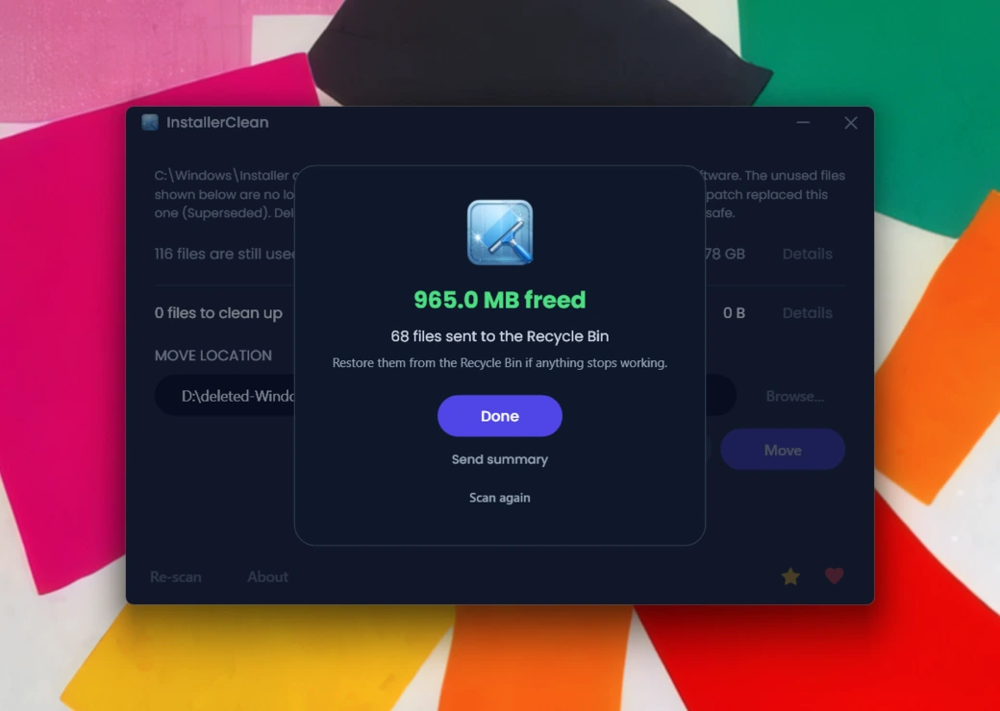
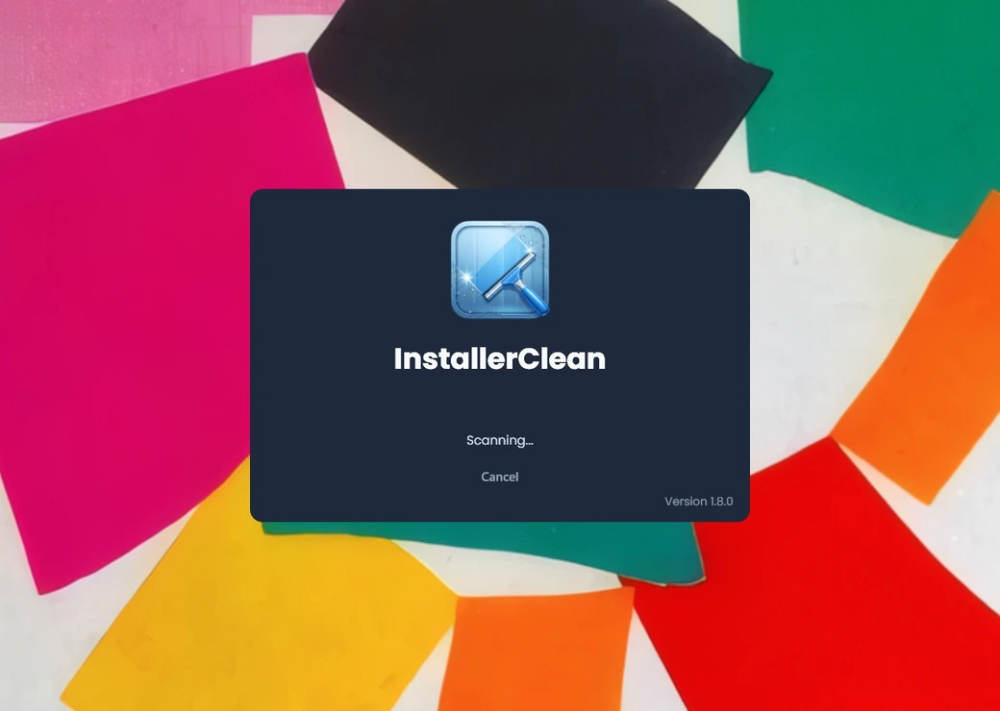
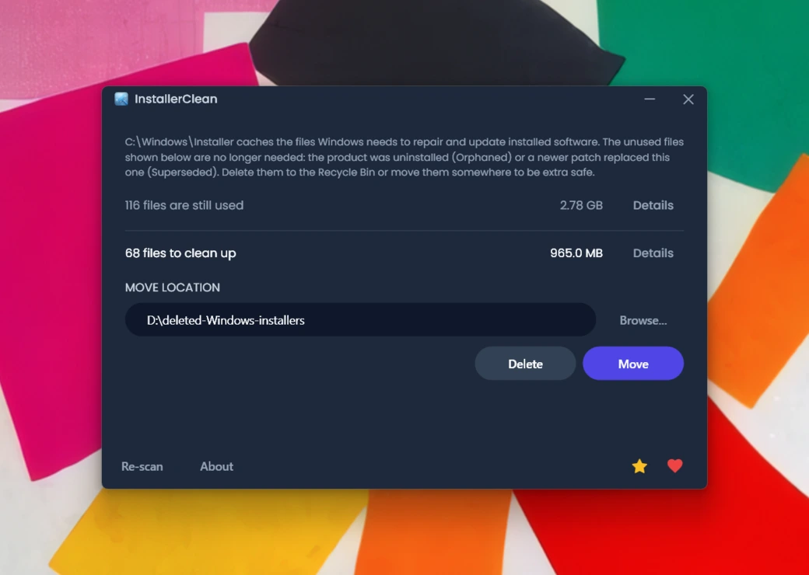
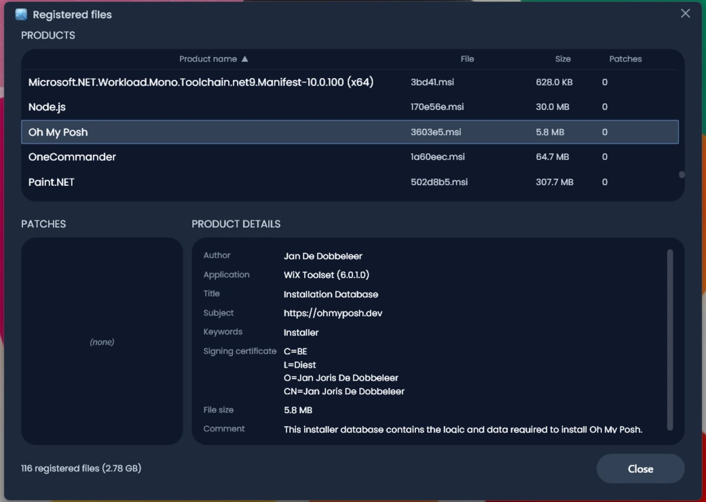
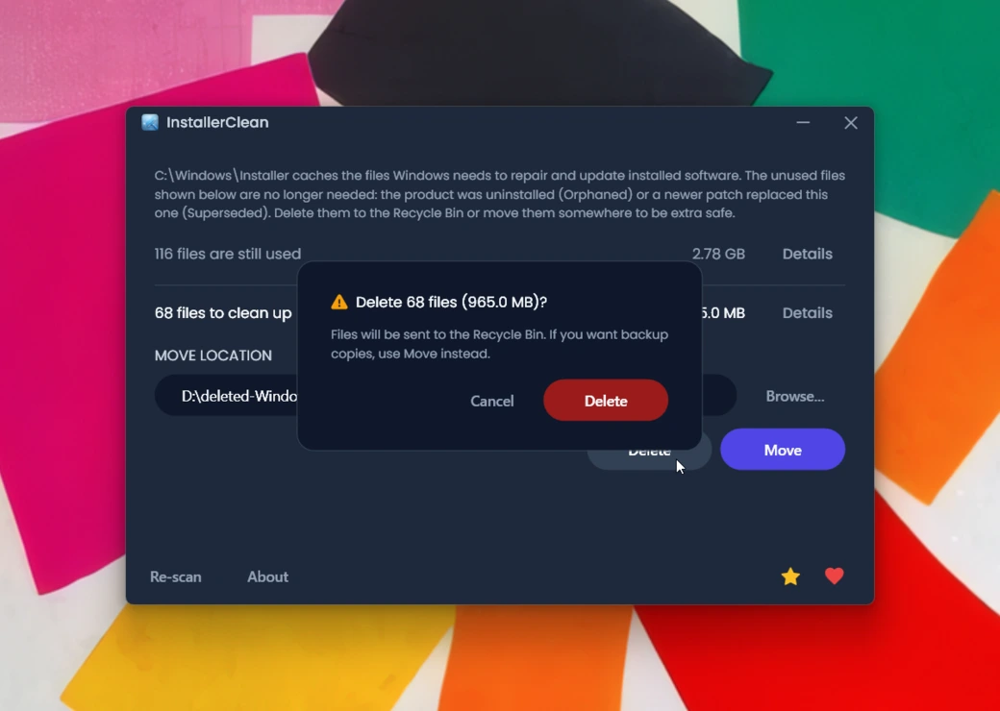
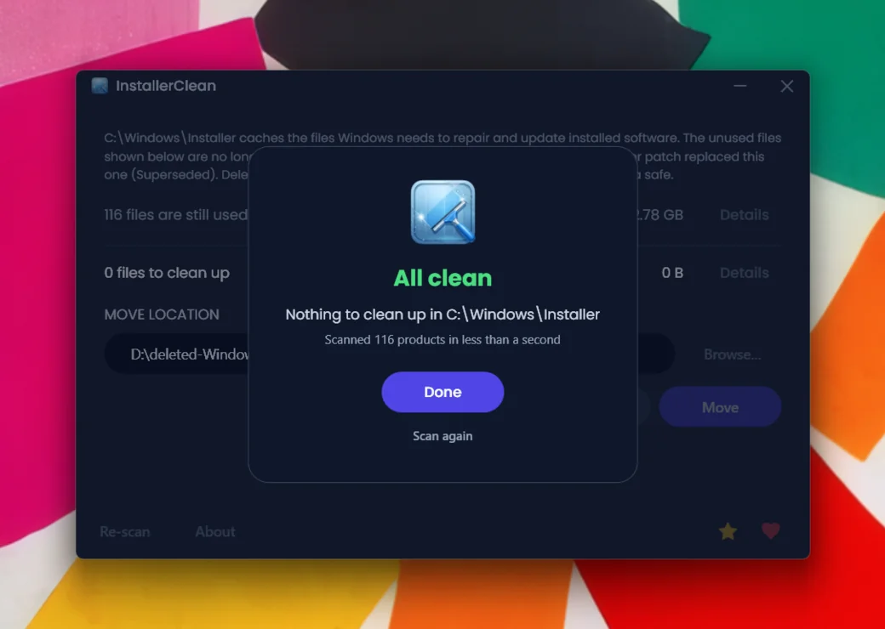

<p align="center">
  <a href="README.md">English</a> · <a href="README.zh-CN.md">简体中文</a> · <a href="README.es.md">Español</a> · <strong>Français</strong>
</p>

<p align="center">
  
</p>

<h1 align="center">InstallerClean</h1>

<p align="center"><strong>Une alternative moderne et open source à <a href="https://www.homedev.com.au/free/patchcleaner">PatchCleaner</a>. Nettoyez en toute sécurité <code>C:\Windows\Installer</code>, le dossier caché de Windows qui grignote silencieusement votre espace disque.</strong></p>

<p align="center">
  <a href="LICENSE"></a>
  <a href="https://dotnet.microsoft.com/download/dotnet/10.0"></a>
  <a href="https://github.com/no-faff/InstallerClean/actions/workflows/ci.yml"></a>
  <a href="https://github.com/no-faff/InstallerClean/releases"></a>
  <a href="https://github.com/no-faff/InstallerClean/releases/latest"></a>
  <a href="https://github.com/no-faff/InstallerClean/releases"></a>
</p>



- **En bref :** Trouve et supprime les fichiers inutiles dans `C:\Windows\Installer`, le dossier caché que Windows ne nettoie jamais.
- **Combien d'espace :** Ça dépend de vos logiciels. Sur ma machine, c'était presque 1 Go. Un utilisateur d'InstallerClean a [rapporté](https://github.com/no-faff/InstallerClean/issues/12#issuecomment-4395580816) 25 Go. Avec Adobe Acrobat installé, ça peut dépasser 100 Go. Ça peut aussi être nul. L'idée, c'est que c'est rapide et gratuit ; tout ce qui peut être supprimé le sera.
- **Est-ce sûr :** Oui. Ne supprime que les fichiers que Windows lui-même déclare inutiles. La suppression envoie à la Corbeille. Le déplacement vous permet de garder les fichiers ailleurs en lieu sûr.
- **Comment l'avoir :** [Téléchargez la dernière version](../../releases/latest), lancez-la, c'est tout.

---

## Le dossier dont personne ne vous parle

Il existe un dossier caché sur tout PC Windows, nommé `C:\Windows\Installer`. Chaque fois que vous installez un logiciel basé sur Windows Installer, ou que vous appliquez un correctif à Microsoft Office, Adobe Acrobat, Visual Studio ou toute autre application `.msi`, une copie de l'installeur ou du fichier de correctif `.msp` atterrit dans ce dossier. Et y reste.

Quand vous désinstallez le logiciel, les fichiers restent. Quand un nouveau correctif en remplace un ancien, les deux restent. Windows ne les nettoie jamais. Le Nettoyage de disque n'y touche pas. DISM concerne un autre dossier. Au fil des années, le dossier grossit : 10 Go, 30 Go, 50 Go. Sur les machines avec beaucoup de logiciels MSI (Acrobat est un coupable récurrent), il peut [dépasser les 100 Go](https://www.reddit.com/r/sysadmin/comments/1oxcrmh/acrobat_filling_up_the_cwindowsinstaller_folder/).

Ce ne sont pas des fichiers temporaires qui réapparaissent dès que vous fermez un nettoyeur. C'est du véritable poids mort : de vieux installeurs de logiciels désinstallés depuis des années et des correctifs remplacés trois fois. Une fois supprimés, ils ne reviennent pas.

**Si vous cherchez un moyen simple de libérer de l'espace disque sur Windows, ce dossier est l'un des meilleurs endroits où commencer.** InstallerClean trouve les fichiers inutiles et les supprime sans risque.

[PatchCleaner](https://www.homedev.com.au/free/patchcleaner) a longtemps été l'outil de référence pour cette tâche, mais il n'a pas été mis à jour depuis mars 2016 et n'est pas open source. InstallerClean en est une alternative open source, avec détection des correctifs remplacés (qui attrape les correctifs Acrobat que PatchCleaner exclut) et une interface moderne.

## La recherche d'aide

Si vous avez déjà cherché de l'aide pour ce dossier, vous savez comment ça se passe. Quelqu'un demande comment le nettoyer. On lui répond de lancer le Nettoyage de disque. Il essaie. Ça libère [600 Mo sur un dossier de 180 Go](https://learn.microsoft.com/en-us/answers/questions/4238108/windows-installer-folder-has-occupied-180gb). Le fil de discussion s'éteint.

> *« Tous les fils que j'ai trouvés ont tendance à recommander les mêmes choses qui ne résolvent pas le problème, avant de s'éteindre. »*
>
> ksparks519, r/Windows10 (traduit de l'anglais)

Ou bien on lui dit de ne pas y toucher du tout. Dans un fil, quelqu'un avec un dossier Installer de 60 Go s'est entendu dire de [« ne pas y toucher »](https://www.reddit.com/r/techsupport/comments/1hw4suq/my_windows_installer_folder_is_like_60gb_so_i/). Quand il a demandé ce qu'il devait faire à la place, la réponse a été : *« Je viens de te le dire. »*

Le conseil habituel confond la suppression aléatoire de fichiers (ce qui est effectivement dangereux) avec la suppression de fichiers que Windows lui-même indique comme inutiles (ce qui ne l'est pas). InstallerClean fait cette dernière.

Si vous avez déjà cherché de l'aide pour ce problème, vous avez probablement déjà trouvé [PatchCleaner](https://www.homedev.com.au/free/patchcleaner) de [John Crawford](https://www.homedev.com.au/). C'est une excellente application. Je l'ai téléchargée et elle a fait exactement ce qu'elle annonçait : libérer beaucoup d'espace. La seule chose qu'elle ne gère pas, ce sont les correctifs Adobe ; elle les exclut par défaut, et sur les machines où Adobe est le plus gros contributeur, beaucoup de fichiers supprimables sont laissés en place :

> *« J'ai téléchargé PatchCleaner pour supprimer les fichiers `.msp` orphelins... 29 Go des fichiers sont 'exclus par filtres', donc PatchCleaner n'est pas d'une grande aide. »*
>
> HeatherBunny1111, [r/techsupport](https://www.reddit.com/r/techsupport/comments/1qc4tcf/how_to_delete_msp_files_safely/) (traduit de l'anglais)

InstallerClean détecte les correctifs remplacés par des mises à jour plus récentes et les marque comme supprimables, y compris les correctifs Acrobat que PatchCleaner exclut.

## Ce qu'il fait

1. **Analyse** `C:\Windows\Installer` à la recherche de fichiers `.msi` et `.msp`
2. **Interroge** l'API Windows Installer pour identifier les fichiers encore enregistrés
3. **Affiche** ce qui est utile et ce qui ne l'est pas, avec les tailles
4. **Supprime** les fichiers inutiles : envoi à la Corbeille, ou déplacement vers un dossier de votre choix

Aucune activité réseau automatique. Deux boutons opt-in déclenchent un seul appel HTTPS sur clic : **Vérifier les mises à jour** dans À propos, et **Envoyer le résultat** sur l'écran de fin. Voir [Ce qu'il ne fait pas](#ce-quil-ne-fait-pas) plus bas pour le détail.

## Captures d'écran

<details>
<summary>Cliquez pour développer</summary>

<br>

<p>
  <br>
  <em>Analyse initiale. Très rapide.</em>
</p>

<p>
  <br>
  <em>Résultats : ce qui est utilisé, ce qui est supprimable.</em>
</p>

<p>
  <br>
  <em>Les fichiers encore en service, avec les métadonnées lues dans la base de l'installeur.</em>
</p>

<p>
  <br>
  <em>Les fichiers devenus inutiles.</em>
</p>

<p>
  <br>
  <em>Confirmation avant chaque action. Supprimer envoie à la Corbeille ; Déplacer met les fichiers où vous voulez.</em>
</p>

<p>
  <br>
  <em>Après une Suppression réussie.</em>
</p>

<p>
  <br>
  <em>Après une nouvelle analyse. Plus rien à nettoyer.</em>
</p>

</details>

## Comment ça marche

InstallerClean identifie deux catégories de fichiers inutiles.

**Les fichiers orphelins** sont des installeurs et des correctifs laissés derrière après désinstallation d'un logiciel. Windows ne les référence plus, mais les fichiers occupent de la place dans le dossier.

**Les correctifs remplacés** sont d'anciens correctifs `.msp` qui ont été remplacés par d'autres plus récents. Windows les marque comme remplacés dans sa propre base mais ne les supprime jamais. Les éditeurs qui publient des correctifs fréquents (Acrobat, Office, gros outils de développement) en accumulent indéfiniment.

Pour les trouver, InstallerClean appelle l'interface COM de Windows Installer directement via P/Invoke :

- `MsiEnumProductsEx` pour énumérer chaque produit installé
- `MsiEnumPatchesEx` pour trouver tous les correctifs enregistrés pour chaque produit
- `MsiGetPatchInfoEx` pour lire l'état d'un correctif (appliqué, remplacé ou rendu obsolète)

Tout fichier `.msi` ou `.msp` dans `C:\Windows\Installer` qui n'est revendiqué par aucun produit enregistré est orphelin. Tout correctif marqué comme remplacé et non requis pour la désinstallation est marqué comme supprimable.

Si l'API renvoie des données incomplètes (rare, mais possible avec un état d'installeur corrompu), l'application se replie sur la lecture du registre. Ce repli n'ajoute des fichiers qu'à l'ensemble « encore utiles », jamais à l'ensemble « supprimables ».

Après un Déplacement ou une Suppression, les sous-dossiers vides à l'intérieur de `C:\Windows\Installer` (les répertoires que le cache laisse derrière une fois leur contenu parti) sont supprimés dans le même passage. Les points d'analyse (reparse points) sont ignorés pendant cette étape afin qu'une jonction plantée à l'intérieur du cache ne puisse pas rediriger le nettoyage à l'extérieur.

## Est-ce sûr ?

Oui. InstallerClean interroge la même base que Windows utilise lui-même pour suivre ce qui est installé. Si Windows indique qu'un fichier n'est plus nécessaire, l'application le croit ; elle ne devine pas à partir des noms de fichiers ou des dates.

**Dans l'application.** La suppression envoie les fichiers à la Corbeille. Le déplacement les met dans un dossier de votre choix. Dans les deux cas, les fichiers peuvent être restaurés en cas de problème. Rien n'est touché tant que vous ne confirmez pas. Si Windows Installer est en train d'écrire dans le cache, a une transaction précédente suspendue, ou a un renommage post-redémarrage en attente ciblant le cache, Déplacer et Supprimer sont désactivés et la raison précise est affichée. Les services de scan, requête, déplacement, suppression, réglages et redémarrage en attente sont couverts par une suite de tests automatisés qui s'exécute à chaque commit (voir le badge CI ci-dessus).

**Vérifier le binaire.** InstallerClean n'est pas signé numériquement. Les certificats de signature de code coûtent de l'argent chaque année, et je préfère garder le projet gratuit, ouvert et financé par les dons.

- Les empreintes SHA-256 de chaque version sont listées sur la [page des versions](../../releases/latest).
- Des liens VirusTotal pour les builds setup, portable et slim sont publiés à chaque version.
- Le code source est sur [github.com/no-faff/InstallerClean](https://github.com/no-faff/InstallerClean) et la CI compile et teste chaque commit (voir le badge CI vert ci-dessus).
- [Softpedia](https://www.softpedia.com/get/System/Hard-Disk-Utils/InstallerClean.shtml) teste chaque version pour virus, logiciels espions et publiciels.
- [MajorGeeks](https://www.majorgeeks.com/files/details/installerclean.html) teste chaque soumission dans une machine virtuelle et ne la liste que si elle passe leur examen.

<a href="https://www.softpedia.com/get/System/Hard-Disk-Utils/InstallerClean.shtml"></a>

VirusTotal : propre sur tous les moteurs. Des liens en direct dans les notes de chaque version pour que vous puissiez revérifier.

## Ce qu'il ne fait pas

- WinSxS (`C:\Windows\WinSxS`) est un dossier différent avec des règles différentes. Pour celui-là, utilisez le Nettoyage de disque intégré de Windows ou `Dism /Online /Cleanup-Image /StartComponentCleanup`.
- Aucun service en arrière-plan, aucune tâche planifiée, aucun nettoyage automatique. L'application s'exécute quand vous la lancez.
- Le registre est en lecture seule. L'application interroge la base Windows Installer ; elle ne la modifie pas.
- Aucune télémétrie automatique, aucune activité réseau en arrière-plan. L'application ne fait aucun appel réseau tant que vous ne cliquez pas sur l'un des deux boutons opt-in. **Vérifier les mises à jour** dans À propos interroge l'API publique des releases de GitHub au moment du clic et vous indique si vous avez la dernière version (un seul GET HTTPS, identifiant `InstallerClean/<version>`). **Envoyer le résumé** sur l'écran de fin lit `%LOCALAPPDATA%\NoFaff\InstallerClean\last-run.json` et l'envoie en HTTPS POST à un endpoint No Faff afin que je puisse voir si l'exécution a réussi. Le JSON contient uniquement des compteurs et des étiquettes catégorielles : aucun chemin de fichier, aucun nom d'utilisateur, aucun identifiant machine, aucune heure du jour. Cliquer ouvre une fenêtre de confirmation montrant le JSON exact qui sera envoyé ; inspectez-le puis appuyez sur Envoyer pour confirmer, ou sur Annuler pour vous rétracter. Une fois par machine : après un envoi réussi le bouton reste caché à jamais ; si la première tentative échoue avec une erreur transitoire, la session suivante redemandera.
- Aucun supplément groupé. Pas de barres d'outils, pas d'offres tierces, pas de fenêtres intempestives.
- La seule autorisation demandée au-delà du lancement est Administrateur, requise parce que `C:\Windows\Installer` est réservé aux administrateurs.

## FAQ

**Est-ce que je vais vraiment libérer des Go ?** Ça dépend de la machine. Une installation de Windows 11 propre sans logiciel supplémentaire n'a rien à supprimer. Une station de développement utilisée depuis longtemps, ou toute machine avec beaucoup de logiciels basés sur MSI (Acrobat, Office, LibreOffice, gros outils de développement), peut contenir des dizaines de Go. Lancez `installerclean-cli /s` pour voir exactement ce qui serait supprimé avant de vous engager.

**Pourquoi a-t-il besoin des droits Administrateur ?** `C:\Windows\Installer` appartient à SYSTEM et son accès est restreint aux administrateurs. Toutes ces opérations (lire le dossier, interroger l'API Windows Installer, déplacer ou supprimer des fichiers) nécessitent une élévation. Il n'existe pas de chemin en mode utilisateur.

**Puis-je annuler une suppression ?** Oui. La suppression envoie les fichiers à la Corbeille. Restaurez-les depuis là. Si vous avez vidé la Corbeille, les fichiers sont perdus, mais vous pouvez utiliser Déplacer pour les mettre dans un dossier de votre choix, vérifier que rien ne casse, puis les supprimer de là.

**Windows va-t-il se plaindre si je supprime ces fichiers ?** Pas en temps normal. InstallerClean ne supprime que les fichiers que Windows lui-même signale comme n'étant plus nécessaires via son API de base d'installeur. L'exception rare est une machine dont la base d'installeur est désynchronisée, en général après une désinstallation précédente qui ne s'est pas terminée proprement. Sur ces machines, une tentative ultérieure de désinstallation d'un produit peut échouer en demandant le `.msi` d'origine. Cela n'a jamais été rapporté sur InstallerClean au fil de plusieurs milliers de téléchargements, mais si cela vous arrive :

- **Si vous avez Supprimé** : restaurez les fichiers depuis la Corbeille. Ils retournent automatiquement dans `C:\Windows\Installer` et la désinstallation aboutit.
- **Si vous avez Déplacé** : recopiez les fichiers de votre dossier de destination dans `C:\Windows\Installer` et la désinstallation aboutit.
- **Aucune copie nulle part** : retéléchargez l'installeur chez l'éditeur et lancez-le ; cela remet un `.msi` neuf dans le cache et la désinstallation aboutit.

**Pourquoi pas `Win32_Product` (WMI) ?** [`Win32_Product` déclenche des opérations de réparation MSI sur chaque produit pendant l'énumération](https://gregramsey.net/2012/02/20/win32_product-is-evil/), ce qui peut prendre plusieurs minutes et solliciter le disque très fort. InstallerClean appelle l'API COM de Windows Installer directement, sans effets de bord.

**Pourquoi pas un simple script PowerShell ?** Un court script qui appelle `MsiEnumPatchesEx` suffit pour *lister* les correctifs, mais ce qui porte InstallerClean ce sont les parties qu'un script survole : la classification orphelin / remplacé, le repli vers le registre qui n'ajoute des fichiers qu'à l'ensemble « encore utiles » (jamais à « supprimables »), le blocage en cas de redémarrage en attente, le filet de sécurité Déplacer-ailleurs, la progression par fichier avec annulation, et le choix par défaut Corbeille plutôt que suppression définitive. Les cas limites sur des machines vraiment chargées en MSI (enregistrements corrompus, jonctions dans le cache, produits dans `HKU\.DEFAULT`, transactions Installer suspendues) sont faciles à mal gérer dans un script ad hoc. La `installerclean-cli` est la version sans interface si c'est du scripting qu'il vous faut.

**Fonctionne-t-il sur Windows 7 ou 8 ?** Non testé et non pris en charge. Cible Windows 10 et 11.

**Convient-il au RMM ou au déploiement de masse ?** Oui. La CLI sort avec des codes distincts par résultat (0 succès, 2 partiel, 1 échec total, 75 transitoire, 130 Ctrl+C), de sorte qu'une tâche planifiée peut réessayer sur 75 sans le confondre avec un échec total. Elle écrit un résumé par exécution dans le journal d'événements Application et respecte le même mutex d'instance unique que l'interface graphique. Voir la section Ligne de commande.

## Téléchargement

Trois builds, choisissez-en un :

- **Setup** (`InstallerClean-setup.exe`) : un installeur Windows classique avec le runtime .NET 10 intégré. Ajoute un raccourci dans le menu Démarrer et se désinstalle proprement. Bien rangé dans les Programmes, facile à retrouver dans six mois.
- **Portable** (`InstallerClean-portable.exe`) : un exe unique autonome avec le runtime intégré. Pas d'installation, pas de désinstallation. Lancez-le, utilisez-le, supprimez-le. Relancez-le quand vous voulez.
- **Slim** (`InstallerClean-slim.exe`) : le téléchargement le plus léger. Nécessite que le [.NET 10 Desktop Runtime](https://dotnet.microsoft.com/download/dotnet/10.0) soit déjà installé (ce qui est le cas si vous avez Visual Studio à jour).

Téléchargez depuis la [page des versions](../../releases/latest), puis lancez. Windows SmartScreen affichera « Éditeur inconnu ». Cliquez sur **Informations complémentaires** puis **Exécuter quand même**. C'est normal pour un logiciel open source non signé.

L'application analyse automatiquement au démarrage. Examinez les résultats, puis cliquez sur **Supprimer** ou **Déplacer**.

Ou installez via [Scoop](https://scoop.sh) :

```
scoop bucket add no-faff https://github.com/no-faff/scoop-bucket
scoop install installerclean
```

## Comparaison avec PatchCleaner

| | **InstallerClean** | **PatchCleaner** |
|---|---|---|
| Dernière mise à jour | 2026 (actif) | 3 mars 2016 |
| Code source | Open source (MIT) | Fermé |
| Runtime | .NET 10 (autonome) | .NET + VBScript |
| API | Windows Installer COM (en cours de processus) | Windows Installer COM (hors processus via VBScript) |
| Détection des correctifs remplacés | Oui | Non |
| Gestion d'Adobe | Détecte les correctifs remplacés | Exclus par défaut |
| Interface | Thème sombre (WPF) | Windows Forms |
| Collecte de données | Aucune | Aucune |

> **À propos de `Win32_Product` :** L'approche courante mais cassée pour lister les produits installés est `Win32_Product` (WMI), qui [déclenche des opérations de réparation MSI](https://gregramsey.net/2012/02/20/win32_product-is-evil/) sur chaque produit pendant l'énumération. InstallerClean comme PatchCleaner l'évitent. Tous deux utilisent l'interface COM de Windows Installer. Le nom de fichier `WMIProducts.vbs` dans le script de PatchCleaner est trompeur ; le script utilise COM MSI, pas WMI.

[Ultra Virus Killer (UVK)](https://www.carifred.com/uvk/) propose aussi un nettoyage du dossier Installer dans son module System Booster, mais c'est un outil payant (15-25 $) et le nettoyage n'est qu'une petite fonctionnalité dans une application bien plus large. InstallerClean est gratuit, ciblé et open source.

Les nettoyeurs système généralistes comme [CCleaner](https://www.ccleaner.com/) et [BleachBit](https://www.bleachbit.org/) ne touchent pas à `C:\Windows\Installer`. Le dossier nécessite des requêtes à l'API Windows Installer pour distinguer les paquets enregistrés des fichiers inutilisés, et un nettoyeur générique qui se contenterait de parcourir l'arborescence pourrait casser des applications installées. InstallerClean est l'outil à choisir quand c'est précisément ce dossier-là que vous voulez nettoyer.

## Ligne de commande

InstallerClean prend en charge un fonctionnement sans interface graphique pour les scripts et l'administration système :

```
Utilisation :
  installerclean-cli --help   Affiche cette aide (accepte aussi /?, -h ou sans argument)
  installerclean-cli /s       Analyse seule, liste les fichiers supprimables
  installerclean-cli /d       Supprime les fichiers (Corbeille)
  installerclean-cli /m       Déplace vers l'emplacement par défaut enregistré
  installerclean-cli /m PATH  Déplace vers le chemin spécifié
```

Pour lancer l'interface graphique, exécutez `InstallerClean.exe` (ou utilisez le raccourci du menu Démarrer si vous avez utilisé l'installeur setup).

`/s` est un essai à blanc : il analyse, liste ce qui serait supprimé avec noms de fichiers et tailles, puis quitte. Utile pour auditer avant nettoyage. Le code de sortie est toujours 0. Tous les fichiers se trouvent dans `C:\Windows\Installer`.

`/d` et `/m` analysent puis agissent. `/d` envoie les fichiers supprimables à la Corbeille. `/m` les déplace vers un dossier (soit celui spécifié sur la ligne de commande, soit celui enregistré par défaut depuis l'interface graphique). Codes de sortie : `0` succès complet, `2` partiel (certains fichiers réussis, certains échoués), `1` échec total (analyse échouée, mauvais arguments, ou tous les fichiers du lot ont échoué), `75` conditions transitoires (une autre instance d'InstallerClean est en cours, ou Windows Installer signale une transaction en attente ; réessai sans risque), `130` Ctrl+C.

Les trois nécessitent une invite de commandes élevée (administrateur). Si la stratégie de groupe bloque l'invite d'élévation UAC, le processus refuse de démarrer et Windows renvoie l'erreur 740 à l'invite parente (`$LASTEXITCODE = 740` en PowerShell). `taskkill /pid <pid>` ne déclenche pas d'annulation propre ; le mutex d'instance unique est récupéré au prochain lancement via le chemin AbandonedMutexException.

À noter : la sortie de la CLI elle-même est en anglais. Les descriptions ci-dessus correspondent aux options disponibles.

### Pourquoi `installerclean-cli` et pas `installerclean.exe` ?

`InstallerClean.exe` est l'interface graphique WPF ; elle ne répond pas aux arguments de ligne de commande. `installerclean-cli.exe` est un exécutable console séparé livré dans le même répertoire d'installation, qui expose les mêmes opérations d'analyse, de déplacement et de suppression à PowerShell, cmd et aux tâches planifiées. Comme c'est un véritable processus console, il bloque l'invite jusqu'à sa fin ; redirigez ou pipez sa sortie comme pour n'importe quel autre exe console.

Les téléchargements portable et slim n'incluent que l'exe d'interface graphique. Pour exécuter les opérations en CLI depuis ces builds, installez via le setup ou installez la CLI séparément.

## Prérequis

- Windows 10 ou 11
- Privilèges administrateur (`C:\Windows\Installer` est réservé aux administrateurs)

Voir [Téléchargement](#téléchargement) pour les options setup, portable et slim.

## Compilation depuis les sources

```
git clone https://github.com/no-faff/InstallerClean.git
cd InstallerClean
dotnet build src/InstallerClean/InstallerClean.csproj
```

Lancer les tests :

```
dotnet test src/InstallerClean.Tests/
```

## Contribuer

Vous avez trouvé un bug ou une suggestion ? [Ouvrez un ticket](../../issues) ou démarrez une [discussion](../../discussions). Les pull requests sont les bienvenues. Lancez `dotnet test` avant de soumettre.

## Soutenir le projet

Si InstallerClean vous a été utile, vous pouvez [soutenir No Faff](https://nofaff.netlify.app/support) ou laisser une étoile sur GitHub.

## Historique des étoiles

<a href="https://www.star-history.com/?repos=no-faff%2FInstallerClean&type=date&legend=top-left">
 <picture>
   <source media="(prefers-color-scheme: dark)" srcset="https://api.star-history.com/chart?repos=no-faff/InstallerClean&type=date&theme=dark&legend=top-left" />
   <source media="(prefers-color-scheme: light)" srcset="https://api.star-history.com/chart?repos=no-faff/InstallerClean&type=date&legend=top-left" />
   
 </picture>
</a>

## Licence

[MIT](LICENSE)
