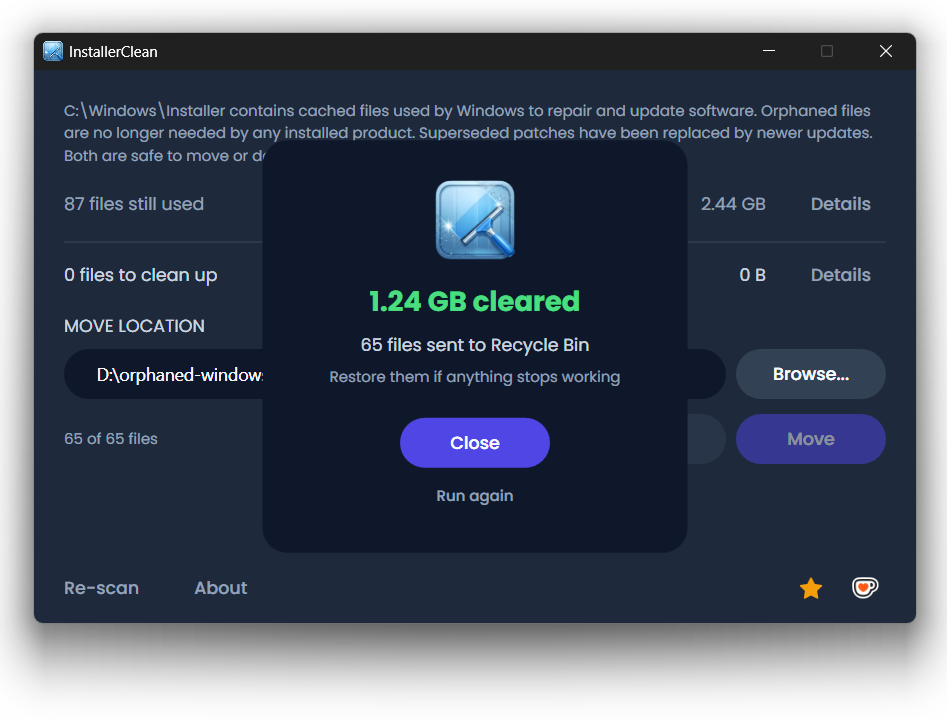

[](LICENSE)
[](https://dotnet.microsoft.com/download/dotnet/8.0)
[](https://github.com/no-faff/InstallerClean/actions/workflows/ci.yml)
[](https://github.com/no-faff/InstallerClean/releases)
[](https://github.com/no-faff/InstallerClean/releases/latest)

# InstallerClean

**Safely clean up `C:\Windows\Installer`, the hidden Windows folder that quietly eats your disk space.**



- **What:** Finds and removes unneeded files from `C:\Windows\Installer`, the hidden folder Windows never cleans up.
- **How much space:** Depends on your software. People report 20-50 GB; with Adobe Acrobat it can pass 100 GB.
- **Is it safe:** Yes. Only removes files Windows itself says it no longer needs. Delete sends to Recycle Bin. Move lets you keep them somewhere safe.
- **Get it:** [Download the latest release](../../releases/latest), run it, done.

---

## The folder nobody tells you about

There's a hidden folder on every Windows PC called `C:\Windows\Installer`. Every time you install software that uses the Windows Installer system, or apply a patch to Microsoft Office, Adobe Acrobat, Visual Studio or any other `.msi`-based application, a copy of that installer or `.msp` patch file goes into this folder. And stays there.

When you uninstall the software, the files stay. When a newer patch replaces an older one, both stay. Windows never cleans them up. Disk Cleanup doesn't touch them. DISM is for a different folder entirely. Over the years, the folder grows: 10 GB, 30 GB, 50 GB. On machines with Adobe Acrobat, it can reach [more than 100 GB](https://www.reddit.com/r/sysadmin/comments/1oxcrmh/acrobat_filling_up_the_cwindowsinstaller_folder/).

These aren't temp files that get recreated the moment you close a cleaning tool. They're genuine dead weight: old installers from software you uninstalled years ago and patches that have been replaced three times over. Once they're gone, they don't come back.

**If you're looking for an easy way to free up disk space on Windows, this folder is one of the best places to start.** InstallerClean finds the unneeded files and removes them safely.

[PatchCleaner](https://www.homedev.com.au/free/patchcleaner) has been the go-to tool for this, but it hasn't been updated since March 2016 and it's closed source. InstallerClean is a new open source alternative, with Adobe patch handling (often the main culprit) and a modern UI.

## The search for help

If you've ever searched for help with this folder, you know how it goes. Someone asks how to clean it. They're told to run Disk Cleanup. They try it. It frees up [600 MB of a 180 GB folder](https://learn.microsoft.com/en-us/answers/questions/4238108/windows-installer-folder-has-occupied-180gb). The thread goes quiet.

> *"All of the threads I've found tend to recommend the same things which don't solve the problem, and then go dead."*
>
> ksparks519, r/Windows10

Or they're told not to touch it at all. In one thread, someone with a 60 GB Installer folder was told to ["don't mess with it."](https://www.reddit.com/r/techsupport/comments/1hw4suq/my_windows_installer_folder_is_like_60gb_so_i/) When they asked what they should do instead, the reply was: *"I just told you."*

The standard advice confuses deleting files at random (which genuinely is dangerous) with removing files that Windows itself says it no longer needs (which isn't). InstallerClean does the latter.

If you've searched for help with this before, you've probably already found [PatchCleaner](https://www.homedev.com.au/free/patchcleaner) by [John Crawford](https://www.homedev.com.au/). It's a fantastic app - I downloaded it and it did exactly what it said, freed up a ton of space. The one thing it doesn't handle is Adobe patches - it excludes them by default, and on machines where Adobe is the biggest offender, that means a lot of removable files get left behind:

> *"I've downloaded Patchcleaner to delete the orphaned .msp files... 29 GB of the files are 'excluded by filters', so Patchcleaner doesn't seem to help."*
>
> HeatherBunny1111, [r/techsupport](https://www.reddit.com/r/techsupport/comments/1qc4tcf/how_to_delete_msp_files_safely/)

InstallerClean detects which Adobe patches have been superseded by newer updates, so it can flag them as removable.

## What it does

1. **Scans** `C:\Windows\Installer` for `.msi` and `.msp` files
2. **Queries** the Windows Installer API to find which files are still registered
3. **Shows** what's needed and what's not, with sizes
4. **Removes** the unneeded files: delete to the Recycle Bin, or move to a folder you choose

No telemetry. No network activity. The About window has a Check for updates link that opens the releases page in your browser.

## How it works

InstallerClean identifies two kinds of unneeded files.

**Orphaned files** are installers and patches left behind after you uninstall software. Windows no longer references them, but the files sit in the folder taking up space.

**Superseded patches** are old `.msp` patches that have been replaced by newer ones. Windows marks them as superseded in its own database but never deletes them. This is especially common with Adobe Acrobat, which delivers roughly 1.1 GB patch files and accumulates superseded ones indefinitely.

To find them, InstallerClean calls the Windows Installer COM interface directly via P/Invoke:

- `MsiEnumProductsEx` to enumerate every installed product
- `MsiEnumPatchesEx` to find all registered patches for each product
- `MsiGetPatchInfoEx` to read patch state (applied, superseded or obsoleted)

Any `.msi` or `.msp` file in `C:\Windows\Installer` that isn't claimed by a registered product is orphaned. Any patch marked as superseded and not required for uninstall is flagged as removable.

If the API returns incomplete data (rare, but it can happen with corrupted installer state), we fall back to reading the registry. The fallback only adds files to the "still needed" set, never to the "removable" set.

## Is it safe?

Yes. We query the same database Windows itself uses to track what's installed. If Windows says a file is no longer needed, we trust it. We don't guess based on filenames or dates.

- **Delete** sends files to the Recycle Bin, so you can restore them if needed
- **Move** copies files to a location you choose first, if you'd rather be cautious
- Nothing is touched until you click Delete or Move and confirm
- The app warns you if Windows has pending updates that could affect results
- More than 150 automated tests cover the core logic and run on every commit (see the green CI badge above)
- [VirusTotal scan of the latest setup.exe](https://www.virustotal.com/gui/file/eb1807b716ba6c6c8b4a33026789e36cf83b624a872324d5792e61a68acb2639). Source code is all on GitHub

## Download

1. Download **InstallerClean-setup.exe** from the [releases page](../../releases/latest) and run the installer. Windows SmartScreen will say "Unknown publisher". Click **More info** then **Run anyway**. This is normal for unsigned open source software
2. The app scans automatically on startup. Review the results, then click **Delete** or **Move**

> **Prefer not to install?** Download **InstallerClean-portable.exe** instead. It's a single file, no install needed. Just download, run and delete it when you're done.

Or install via [Scoop](https://scoop.sh):

```
scoop bucket add no-faff https://github.com/no-faff/scoop-bucket
scoop install installerclean
```

## Compared to PatchCleaner

| | **InstallerClean** | **PatchCleaner** |
|---|---|---|
| Last updated | 2026 (active) | 3 March 2016 |
| Source code | Open source (MIT) | Closed source |
| Runtime | .NET 8 (self-contained) | .NET + VBScript |
| API | Windows Installer COM (direct) | WMI (`Win32_Product`) |
| Superseded patch detection | Yes | No |
| Adobe handling | Detects superseded patches | Excludes by default |
| UI | Dark theme (WPF) | Windows Forms |
| Data collection | None | None |

> **A note on WMI:** PatchCleaner uses `Win32_Product`, which is known to [trigger MSI repair operations](https://gregramsey.net/2012/02/20/win32_product-is-evil/) during enumeration. InstallerClean calls the Windows Installer COM interface directly with no side effects.

[Ultra Virus Killer (UVK)](https://www.carifred.com/uvk/) also offers Installer cleanup as part of its System Booster module, but it's a paid tool ($15-25) and the cleanup is one small feature inside a much larger application. InstallerClean is free, focused and open source.

## Command line

InstallerClean supports headless operation for scripting and sysadmin use:

```
Usage:
  installerclean-cli           Launch the GUI
  installerclean-cli /s        Scan only - list removable files
  installerclean-cli /d        Delete removable files (Recycle Bin)
  installerclean-cli /m        Move to saved default location
  installerclean-cli /m PATH   Move to specified path
```

Also accepts `--help`, `/?` and `-h`.

`/s` is a dry run: it scans, lists what it would remove with filenames and sizes, then exits. Useful for auditing before cleanup. Exit code is always 0. All files are in `C:\Windows\Installer`.

`/d` and `/m` scan and then act. `/d` sends removable files to the Recycle Bin. `/m` moves them to a folder (either one you specify on the command line, or the default saved from the GUI). Exit code is 0 on success, 1 if any files failed.

All three require an elevated (administrator) command prompt.

### Why `installerclean-cli` and not `installerclean.exe`?

InstallerClean is a WPF app so PowerShell and cmd do not wait for it when you run the raw `InstallerClean.exe /s`, which makes CLI output interleave with your shell prompt. `installerclean-cli.exe` is a tiny console launcher (under 50 KB) that forwards its arguments to the real app and blocks until the scan completes. You'll find it alongside `InstallerClean.exe` in the install directory. Its source is in `cli-launcher/launcher.c` in the repository.

Portable and slim downloads are single-file and don't include the launcher. To use them from PowerShell, wrap the invocation yourself:

```powershell
Start-Process -Wait -NoNewWindow .\InstallerClean-portable.exe -ArgumentList '/s'
```

## Features

- **Delete or move.** Delete sends to the Recycle Bin. Move lets you keep files somewhere safe.
- **Superseded patch detection.** Finds patches Windows itself has marked as replaced.
- **Detail views.** Inspect individual files with product name, size, reason and digital signature.
- **Pending reboot detection.** Warns if pending updates might affect scan results.
- **Subfolder cleanup.** Prunes empty subfolders left behind by old installer operations.
- **Command line mode.** `/s` to scan, `/d` to delete, `/m` to move - for scripting and automation.
- **No installer needed.** Download the portable or slim version, run, done.
- **Latest release link.** Jump to the releases page from the About window.

## Requirements

- Windows 10 or 11
- Administrator privileges (to access `C:\Windows\Installer`)
- The setup installer (~69 MB) and portable exe (~76 MB) bundle the .NET 8 runtime so nothing else needs to be installed. Choose portable unless you want an installer
- Already have [.NET 8 Desktop Runtime](https://dotnet.microsoft.com/download/dotnet/8.0)? You do if you have Visual Studio installed (not to be confused with VS Code). Grab **InstallerClean-slim.exe** (7.7 MB) from the releases page instead

## Building from source

```
git clone https://github.com/no-faff/InstallerClean.git
cd InstallerClean
dotnet build src/InstallerClean/InstallerClean.csproj
```

Run the tests:

```
dotnet test src/InstallerClean.Tests/
```

## Contributing

Found a bug or have a suggestion? [Open an issue](../../issues) or start a [discussion](../../discussions). Pull requests welcome. Please run `dotnet test` before submitting.

## Support the project

If InstallerClean helped, consider [supporting No Faff](https://nofaff.netlify.app) or leaving a star on GitHub.

## Licence

[MIT](LICENSE)
