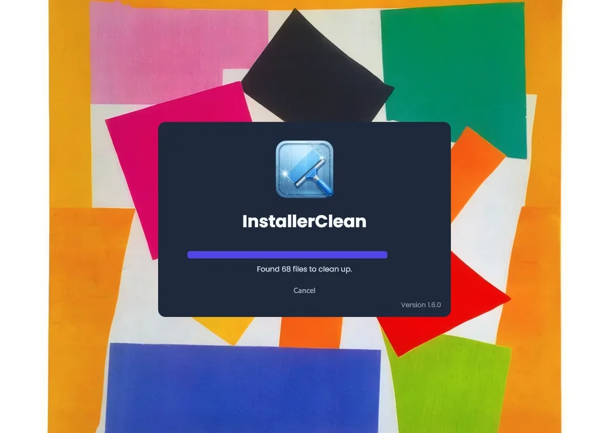
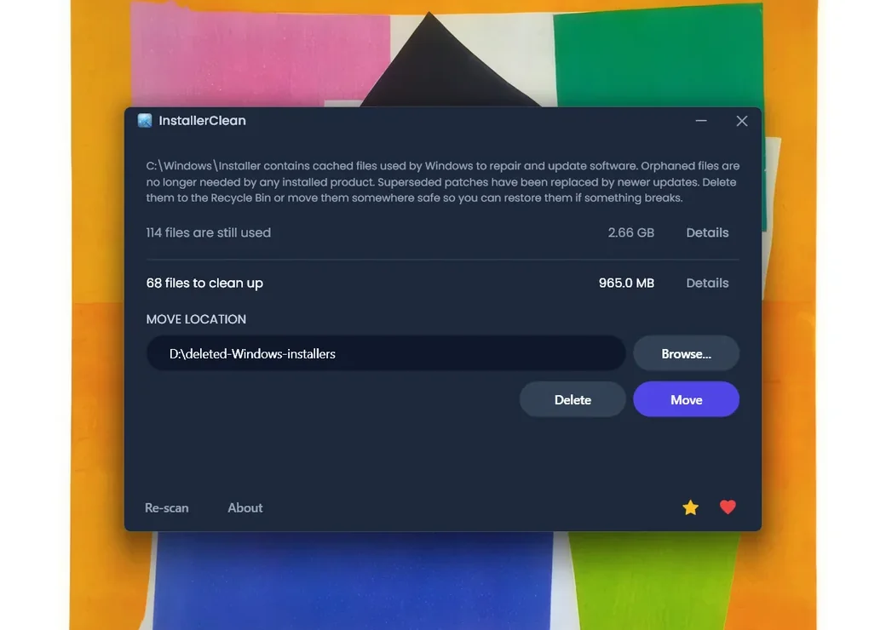
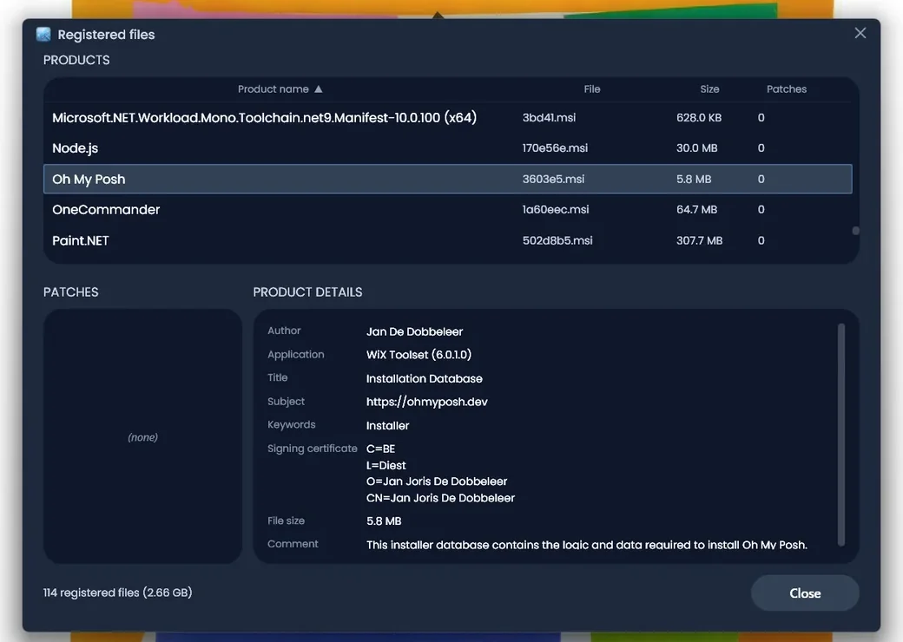
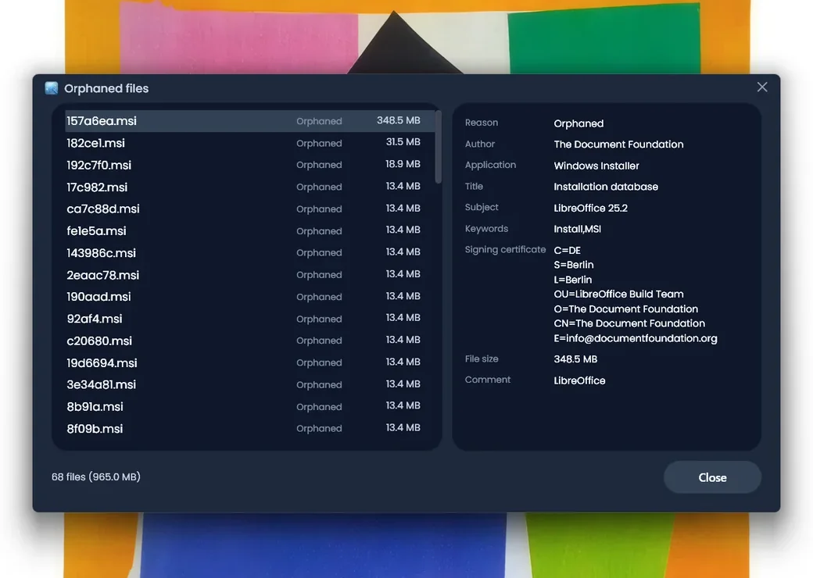
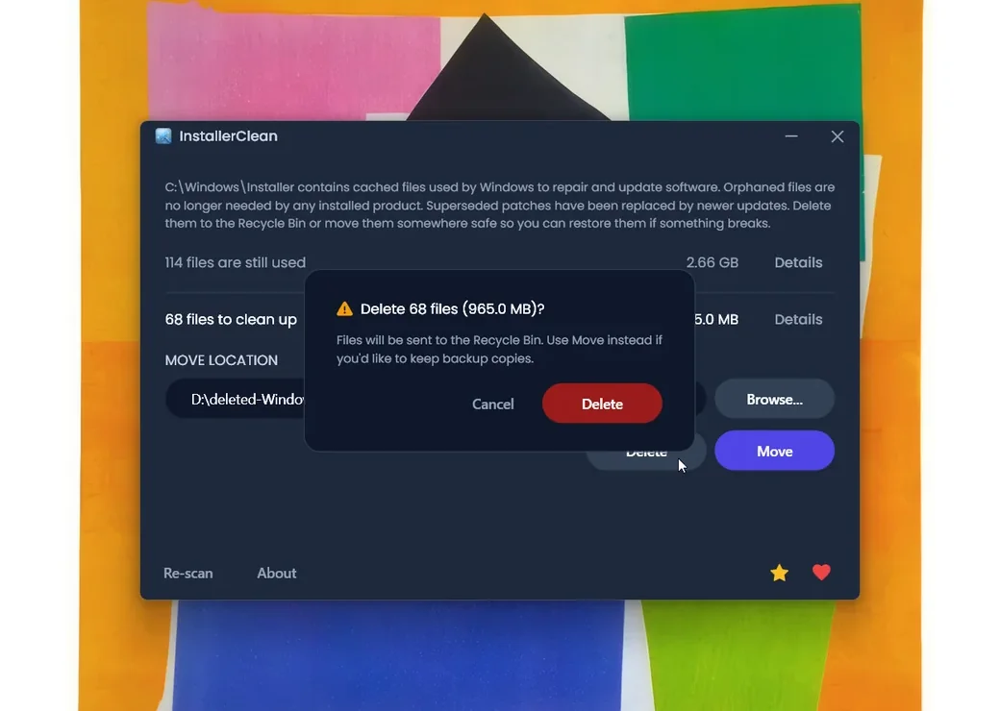
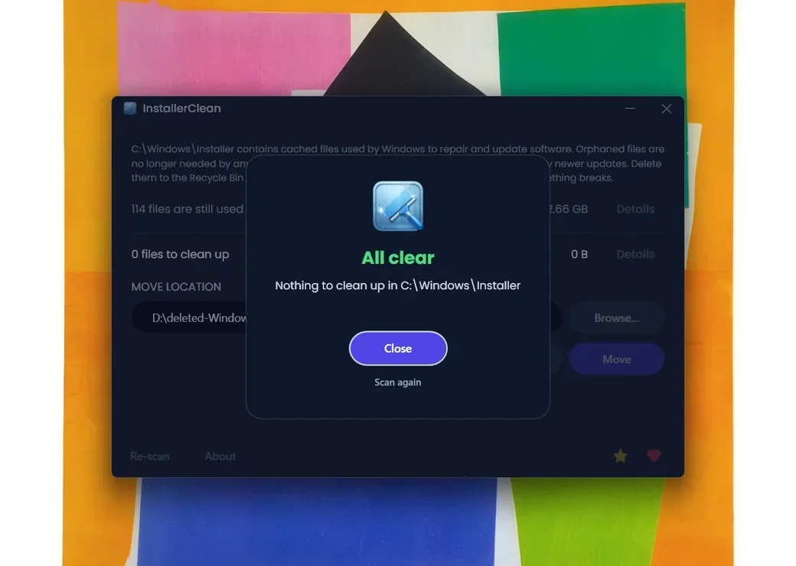

<p align="center">
  <a href="README.md">English</a> · <a href="README.fr.md">Français</a> · <strong>简体中文</strong>
</p>

<p align="center">
  
</p>

<h1 align="center">InstallerClean</h1>

<p align="center"><strong>一个现代的开源 <a href="https://www.homedev.com.au/free/patchcleaner">PatchCleaner</a> 替代方案。安全清理 <code>C:\Windows\Installer</code>，这个悄悄吞噬您磁盘空间的隐藏 Windows 文件夹。</strong></p>

<p align="center">
  <a href="LICENSE"></a>
  <a href="https://dotnet.microsoft.com/download/dotnet/10.0"></a>
  <a href="https://github.com/no-faff/InstallerClean/actions/workflows/ci.yml"></a>
  <a href="https://github.com/no-faff/InstallerClean/releases"></a>
  <a href="https://github.com/no-faff/InstallerClean/releases/latest"></a>
  <a href="https://github.com/no-faff/InstallerClean/releases"></a>
</p>


- **简介：** 在 `C:\Windows\Installer` 中查找并删除不需要的文件，这是 Windows 从不清理的隐藏文件夹。
- **能释放多少空间：** 取决于您的软件。在我的电脑上接近 1 GB。一位 InstallerClean 用户[报告](https://github.com/no-faff/InstallerClean/issues/12#issuecomment-4395580816)清理出 25 GB。安装了 Adobe Acrobat 时可能超过 100 GB。也可能完全没有。关键是它既快又免费；凡是能清理的，都会被清理掉。
- **是否安全：** 是的。仅删除 Windows 自身确认不再需要的文件。删除会将文件发送到回收站。移动会让您把文件保存到安全的位置。
- **如何获取：** [下载最新版本](../../releases/latest)，运行，搞定。

---

## 没有人告诉您的文件夹

每台 Windows 电脑上都有一个名为 `C:\Windows\Installer` 的隐藏文件夹。每次您安装基于 Windows Installer 的软件，或为 Microsoft Office、Adobe Acrobat、Visual Studio 或其他任何 `.msi` 应用程序打补丁时，安装程序或 `.msp` 补丁文件的副本都会进入这个文件夹，然后留在那里。

当您卸载软件时，这些文件依然留着。当新补丁取代旧补丁时，两者都留着。Windows 从不清理它们。磁盘清理工具不碰这些文件。DISM 是用于另一个文件夹的工具。年复一年，这个文件夹越来越大：10 GB、30 GB、50 GB。在大量使用 MSI 软件的电脑上（Acrobat 是常见元凶），它可能[超过 100 GB](https://www.reddit.com/r/sysadmin/comments/1oxcrmh/acrobat_filling_up_the_cwindowsinstaller_folder/)。

这些不是关闭清理工具后又会重新生成的临时文件。它们是真正的累赘：多年前卸载的软件留下的旧安装程序，还有被替换过三次的补丁。一旦清理掉，它们不会回来。

**如果您正在寻找一种简单的方法来释放 Windows 上的磁盘空间，这个文件夹是最佳的起点之一。** InstallerClean 找到这些不需要的文件并安全地删除它们。

[PatchCleaner](https://www.homedev.com.au/free/patchcleaner) 长期以来是处理这一问题的首选工具，但自 2016 年 3 月以来未再更新，且不是开源的。InstallerClean 是它的开源替代方案，具备被取代补丁的检测能力（能识别 PatchCleaner 排除的 Acrobat 补丁），还有现代的用户界面。

## 寻求帮助

如果您曾经为这个文件夹寻找过帮助，您就知道是怎么回事。有人问怎么清理它。被告知运行磁盘清理。试了一下。在 [180 GB 的文件夹中只释放了 600 MB](https://learn.microsoft.com/en-us/answers/questions/4238108/windows-installer-folder-has-occupied-180gb)。然后讨论就没下文了。

> *"我找到的所有帖子都倾向于推荐同样的方法，这些方法解决不了问题，然后讨论就死了。"*
>
> ksparks519, r/Windows10（英文原帖翻译）

或者被告知完全不要碰它。在一个帖子中，有人因为 60 GB 的 Installer 文件夹收到了 ["不要碰它"](https://www.reddit.com/r/techsupport/comments/1hw4suq/my_windows_installer_folder_is_like_60gb_so_i/) 的回复。当他问应该怎么做时，回答是：*"我刚才不就说过了吗。"*

主流建议把"随机删除文件"（这确实危险）和"删除 Windows 自身确认不再需要的文件"（这并不危险）混为一谈。InstallerClean 做的是后者。

如果您之前找过这方面的帮助，您可能已经发现了 [John Crawford](https://www.homedev.com.au/) 开发的 [PatchCleaner](https://www.homedev.com.au/free/patchcleaner)。这是一款很棒的应用。我下载它，它做了它声称要做的事：释放了大量空间。它唯一不处理的是 Adobe 补丁；它默认排除这些补丁，而在 Adobe 是最大占用源的电脑上，大量可删除的文件就被留下了：

> *"我下载了 PatchCleaner 来删除孤立的 .msp 文件……但 29 GB 的文件都被'过滤器排除'了，所以 PatchCleaner 似乎帮不上忙。"*
>
> HeatherBunny1111, [r/techsupport](https://www.reddit.com/r/techsupport/comments/1qc4tcf/how_to_delete_msp_files_safely/)（英文原帖翻译）

InstallerClean 检测被新版本取代的补丁，并将其标记为可删除，包括 PatchCleaner 排除的 Acrobat 补丁。

## 它做什么

1. **扫描** `C:\Windows\Installer` 中的 `.msi` 和 `.msp` 文件
2. **查询** Windows Installer API 以确定哪些文件仍处于注册状态
3. **显示** 哪些是需要的、哪些是不需要的，并附带文件大小
4. **删除** 不需要的文件：发送到回收站，或移动到您选择的文件夹

无遥测。无网络活动。"关于"窗口中有一个"检查更新"链接，会在浏览器中打开版本发布页面。

## 截图

<details>
<summary>点击展开</summary>

<br>

<p>
  <br>
  <em>初始扫描，速度很快。</em>
</p>

<p>
  <br>
  <em>结果：哪些在使用、哪些可清理。</em>
</p>

<p>
  <br>
  <em>仍在使用的文件，附带从安装数据库读取的元数据。</em>
</p>

<p>
  <br>
  <em>不再需要的文件。</em>
</p>

<p>
  <br>
  <em>每次操作前都会有确认。删除发送到回收站；移动则把文件放到您选择的位置。</em>
</p>

<p>
  <br>
  <em>移动成功后的画面。</em>
</p>

<p>
  <br>
  <em>再次扫描后，已无可清理。</em>
</p>

</details>

## 工作原理

InstallerClean 识别两类不需要的文件。

**孤立文件** 是卸载软件后留下的安装程序和补丁。Windows 不再引用它们，但这些文件仍占据着文件夹中的空间。

**被取代的补丁** 是被新补丁替换的旧 `.msp` 补丁。Windows 在自己的数据库中将它们标记为已被取代，但从不删除。频繁发布补丁的厂商（Acrobat、Office、大型开发工具）会无限累积被取代的补丁。

为了找到它们，InstallerClean 通过 P/Invoke 直接调用 Windows Installer COM 接口：

- `MsiEnumProductsEx` 枚举每个已安装的产品
- `MsiEnumPatchesEx` 查找每个产品所有已注册的补丁
- `MsiGetPatchInfoEx` 读取补丁状态（已应用、被取代或已废弃）

`C:\Windows\Installer` 中没有被任何已注册产品声明的 `.msi` 或 `.msp` 文件即为孤立文件。任何被标记为已被取代且不需要用于卸载的补丁，都会被标记为可删除。

如果 API 返回的数据不完整（很少见，但在安装程序状态损坏时可能发生），应用会回退到读取注册表。这种回退只会向"仍需保留"的集合中添加文件，绝不会向"可删除"集合添加。

移动或删除完成后，`C:\Windows\Installer` 内的空子文件夹（缓存清空后留下的目录）会在同一次操作中被清理。在此过程中，重新分析点（reparse points）会被跳过，这样植入缓存内的目录联接（junction）就无法把清理引向缓存之外。

## 是否安全？

是的。InstallerClean 查询的是 Windows 自己用来追踪安装内容的同一个数据库。如果 Windows 说某个文件不再需要，应用就相信这一点；它不会根据文件名或日期来猜测。

**应用内部。** 删除会将文件发送到回收站。移动会把它们放到您选择的文件夹中。无论哪种方式，文件都可以在出问题时恢复。在您确认之前不会动任何文件。如果 Windows Installer 正在写入缓存、有先前的事务被挂起、或有针对缓存的开机后重命名待执行，移动和删除会被禁用，并显示具体的原因。核心逻辑由 200 多项自动化测试覆盖，每次提交都会运行（参见上方的 CI 徽章）。

**验证二进制文件。** InstallerClean 没有数字签名。代码签名证书每年都要花钱，我宁愿让项目保持免费、开源、由捐赠支持。

- 每个版本的 SHA-256 哈希值都列在[发布页面](../../releases/latest)。
- 每个版本都会发布 setup、portable 和 slim 三个构建的 VirusTotal 链接。
- 源代码在 [github.com/no-faff/InstallerClean](https://github.com/no-faff/InstallerClean)，CI 会编译并测试每次提交（参见上方绿色 CI 徽章）。
- [Softpedia](https://www.softpedia.com/get/System/Hard-Disk-Utils/InstallerClean.shtml) 对每个版本进行病毒、间谍软件和广告软件检测。
- [MajorGeeks](https://www.majorgeeks.com/files/details/installerclean.html) 在虚拟机中测试每次提交，只有通过审核后才会上架。

<a href="https://www.softpedia.com/get/System/Hard-Disk-Utils/InstallerClean.shtml"></a>

三个构建（setup、portable 和 slim）在 VirusTotal 上均为干净，没有任何引擎检出。

## 它不做什么

- WinSxS（`C:\Windows\WinSxS`）是另一个有不同规则的文件夹。对于那个文件夹，请使用 Windows 内置的磁盘清理或 `Dism /Online /Cleanup-Image /StartComponentCleanup`。
- 没有后台服务、没有计划任务、没有自动清理。应用只在您启动它时运行。
- 注册表只读。应用查询 Windows Installer 数据库；它不会修改数据库。
- 无遥测、无使用情况报告、无版本检查 ping。"关于"中的"检查更新"链接会在您的浏览器中打开 GitHub 版本发布页面。
- 无捆绑附加。无工具栏，无第三方推广，无烦人弹窗。
- 启动之外要求的唯一权限是管理员权限，这是因为 `C:\Windows\Installer` 仅限管理员访问。

## 常见问题

**我真的能释放几 GB 的空间吗？** 取决于您的电脑。一台没有额外软件的全新 Windows 11 安装上没有什么可清理的。一台长期使用的开发工作站，或任何安装了大量基于 MSI 的软件（Acrobat、Office、LibreOffice、大型开发工具）的电脑，可能有几十 GB。运行 `installerclean-cli /s` 可以在执行之前查看具体会删除哪些文件。

**为什么需要管理员权限？** `C:\Windows\Installer` 归 SYSTEM 所有，仅向管理员开放。读取该文件夹、调用 Windows Installer 数据库 API、移动或删除文件，都需要权限提升。没有用户态的路径。

**可以撤销删除吗？** 可以。删除会把文件发送到回收站，从那里恢复即可。如果您清空了回收站，文件就消失了；不过您可以改用"移动"功能把文件放到您选择的文件夹，确认没有问题后再从那里删除。

**删除这些文件 Windows 会有意见吗？** 不会。InstallerClean 只删除 Windows 自身通过其安装数据库 API 报告为不再需要的文件。下次的安装、卸载或补丁过程会正常进行。

**为什么不用 `Win32_Product`（WMI）？** [`Win32_Product` 在枚举时会触发每个产品的 MSI 修复操作](https://gregramsey.net/2012/02/20/win32_product-is-evil/)，可能耗时数分钟并使磁盘负载剧增。InstallerClean 直接调用 Windows Installer COM API，无副作用。

**支持 Windows 7 或 8 吗？** 未测试，不支持。目标平台是 Windows 10 和 11。

**适合 RMM 或大规模部署吗？** 是的。CLI 退出码采用三态（0 / 2 / 1 = 完全成功 / 部分 / 失败；130 表示 Ctrl+C），每次运行会向应用程序事件日志写入一份摘要，并遵循与图形界面相同的单实例互斥锁。详见命令行部分。

## 下载

三种构建，请选其一：

- **Setup**（`InstallerClean-setup.exe`）：标准的 Windows 安装程序，自带 .NET 10 运行时。适合大多数用户。
- **Portable**（`InstallerClean-portable.exe`）：单一自包含可执行文件，无需安装。自带运行时。运行、使用、删除即可。
- **Slim**（`InstallerClean-slim.exe`）：体积最小。需要事先安装 [.NET 10 Desktop Runtime](https://dotnet.microsoft.com/download/dotnet/10.0)（如果您的 Visual Studio 是最新版本，那就已经装了）。

从[发布页面](../../releases/latest)下载，然后运行。Windows SmartScreen 会提示"未知发布者"。点击"**更多信息**"然后"**仍要运行**"。这对未签名的开源软件而言是正常情况。

应用启动时会自动扫描。查看结果，然后点击"**删除**"或"**移动**"。

或通过 [Scoop](https://scoop.sh) 安装：

```
scoop bucket add no-faff https://github.com/no-faff/scoop-bucket
scoop install installerclean
```

## 与 PatchCleaner 对比

| | **InstallerClean** | **PatchCleaner** |
|---|---|---|
| 最近更新 | 2026（持续维护） | 2016 年 3 月 3 日 |
| 源代码 | 开源（MIT） | 闭源 |
| 运行时 | .NET 10（自包含） | .NET + VBScript |
| API | Windows Installer COM（直接） | WMI（`Win32_Product`） |
| 被取代补丁检测 | 有 | 无 |
| Adobe 处理 | 检测被取代补丁 | 默认排除 |
| 用户界面 | 深色主题（WPF） | Windows Forms |
| 数据收集 | 无 | 无 |

> **关于 WMI 的说明：** PatchCleaner 使用 `Win32_Product`，已知会在枚举时[触发 MSI 修复操作](https://gregramsey.net/2012/02/20/win32_product-is-evil/)。InstallerClean 直接调用 Windows Installer COM 接口，没有副作用。

[Ultra Virus Killer (UVK)](https://www.carifred.com/uvk/) 也在其 System Booster 模块中提供 Installer 清理功能，但它是付费工具（15 至 25 美元），清理只是其中的一个小功能。InstallerClean 是免费、专一、开源的。

像 [CCleaner](https://www.ccleaner.com/) 和 [BleachBit](https://www.bleachbit.org/) 这类通用系统清理工具不会处理 `C:\Windows\Installer`。这个文件夹需要 Windows Installer API 查询来区分已注册的包和孤立文件，仅遍历文件树的通用清理工具可能会破坏已安装的应用。当您要清理的就是这个文件夹时，InstallerClean 是合适的工具。

## 命令行

InstallerClean 支持无界面运行，方便编写脚本和系统管理：

```
用法：
  installerclean-cli           显示此帮助并退出
  installerclean-cli /s        仅扫描，列出可删除的文件
  installerclean-cli /d        删除文件（送至回收站）
  installerclean-cli /m        移动到已保存的默认位置
  installerclean-cli /m PATH   移动到指定路径
```

也接受 `--help`、`/?` 和 `-h`。要启动图形界面，请运行 `InstallerClean.exe`（或使用 setup 安装后的"开始"菜单快捷方式）。

`/s` 是空跑模式：扫描、列出将被删除的文件名和大小，然后退出。便于在清理前审核。退出码始终为 0。所有文件都在 `C:\Windows\Installer` 中。

`/d` 和 `/m` 先扫描后执行。`/d` 将可删除文件发送到回收站。`/m` 将它们移动到一个文件夹（您在命令行指定的、或图形界面保存的默认值）。退出码：成功为 0，任何文件失败为 1。

三个命令都需要管理员权限的命令提示符。

注意：CLI 自身的输出是英文的。上面的描述对应可用的选项。

### 为什么是 `installerclean-cli` 而不是 `installerclean.exe`？

`InstallerClean.exe` 是 WPF 图形界面，不响应命令行参数。`installerclean-cli.exe` 是单独的控制台可执行文件，与图形界面在同一安装目录下，将相同的扫描、移动、删除操作暴露给 PowerShell、cmd 和计划任务。因为它是真正的控制台进程，会阻塞命令提示符直到完成；像其他控制台 exe 一样可以重定向或管道输出。

portable 和 slim 下载只包含图形界面 exe。如需在这些版本上运行 CLI 操作，请通过 setup 安装，或单独安装 CLI。

## 系统要求

- Windows 10 或 11
- 管理员权限（`C:\Windows\Installer` 仅限管理员访问）

setup、portable 和 slim 三种构建选项见[下载](#下载)。

## 从源码构建

```
git clone https://github.com/no-faff/InstallerClean.git
cd InstallerClean
dotnet build src/InstallerClean/InstallerClean.csproj
```

运行测试：

```
dotnet test src/InstallerClean.Tests/
```

## 参与贡献

发现 bug 或有建议？[提交 issue](../../issues) 或开启[讨论](../../discussions)。欢迎 pull request。提交前请先运行 `dotnet test`。

## 支持本项目

如果 InstallerClean 帮到了您，欢迎[支持 No Faff](https://nofaff.netlify.app)，或在 GitHub 上点亮一颗 star。

## Star 历史

<a href="https://www.star-history.com/?repos=no-faff%2FInstallerClean&type=date&legend=top-left">
 <picture>
   <source media="(prefers-color-scheme: dark)" srcset="https://api.star-history.com/chart?repos=no-faff/InstallerClean&type=date&theme=dark&legend=top-left" />
   <source media="(prefers-color-scheme: light)" srcset="https://api.star-history.com/chart?repos=no-faff/InstallerClean&type=date&legend=top-left" />
   
 </picture>
</a>

## 许可证

[MIT](LICENSE)
